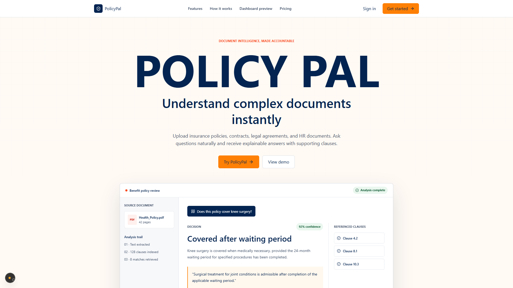
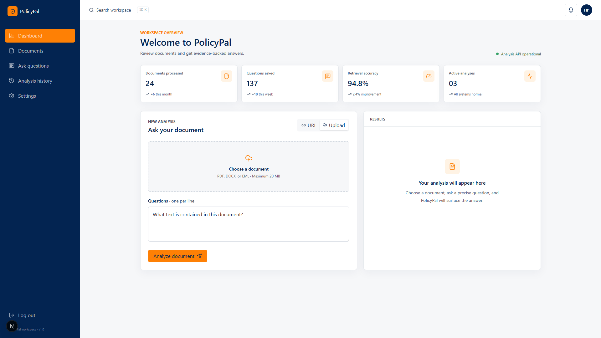

# PolicyPal

**Explainable document intelligence for policies, contracts, legal agreements, and HR documents.**

Upload a PDF, DOCX, or EML file, or provide a public document URL. Ask questions in plain English and receive answers grounded in the most relevant passages retrieved from that document.

`Python` `FastAPI` `Next.js` `TypeScript` `Gemini` `Pinecone` `RAG`

## Product Preview

### Landing page



### Analysis workspace



## What It Does

Long policies and agreements are difficult to search and too large to send to an LLM repeatedly. PolicyPal uses Retrieval Augmented Generation (RAG) to narrow each question to the passages that matter:

1. Extract text from a supported document.
2. Split the text into overlapping chunks.
3. Generate Gemini embeddings for each chunk.
4. Store vectors in an isolated Pinecone namespace.
5. Retrieve the eight most relevant chunks for the submitted questions.
6. Ask Gemini to produce concise JSON answers grounded in those excerpts.

This keeps prompts focused, limits cross-document contamination, and avoids presenting heuristic text fragments as successful AI answers.

## Architecture

```text
INGEST
Document URL or multipart upload
  -> validate type and size
  -> extract text (PyMuPDF / python-docx / email)
  -> recursive chunking (1,200 characters, 250 overlap)
  -> embed chunks (Gemini gemini-embedding-001)
  -> upsert to a per-document Pinecone namespace

QUERY
Natural-language questions
  -> embed the combined query
  -> cosine similarity search (top-k=8)
  -> assemble retrieved excerpts and questions
  -> Gemini gemini-2.5-flash
  -> return { "answers": [...] }

FRONTEND
Browser
  -> Next.js dashboard
  -> server-side /api/analyze proxy
  -> FastAPI /api/v1 endpoint
```

## Key Design Decisions

**Namespace-per-document isolation** - a deterministic source ID scopes every Pinecone write and query, preventing results from unrelated documents from mixing.

**Idempotent URL ingestion** - the pipeline checks for existing vectors before re-embedding a URL. Direct uploads use a fresh temporary source and are removed from local storage after processing.

**Server-side credential boundary** - the browser calls the Next.js API proxy. Optional bearer credentials stay on the Next.js server and are never included in the client bundle.

**Grounded generation** - Gemini receives only retrieved document excerpts and is instructed to say when the available context does not contain an answer. Provider failures surface as errors instead of unrelated fallback text.

**Two ingestion modes** - URL analysis and multipart uploads converge on the same parsing, embedding, retrieval, and answer-generation pipeline.

## Tech Stack

| Layer | Technology |
| --- | --- |
| Frontend | Next.js 16, React 19, TypeScript, Tailwind CSS 4 |
| Backend | FastAPI, Uvicorn, Pydantic |
| Embeddings | Gemini `gemini-embedding-001` |
| Answer generation | Gemini `gemini-2.5-flash` |
| Vector database | Pinecone Serverless, cosine similarity |
| Chunking | LangChain `RecursiveCharacterTextSplitter` |
| Document parsing | PyMuPDF, python-docx, Python email library |
| Testing | Pytest, FastAPI TestClient, ESLint, Next.js production build |

## API

All application endpoints use the `/api/v1` prefix.

### Analyze a document URL

`POST /api/v1/process-document`

```json
{
  "documents": "https://example.com/policy.pdf",
  "questions": [
    "What is the waiting period?",
    "Which exclusions apply?"
  ]
}
```

### Upload and analyze a file

`POST /api/v1/process-upload`

Multipart form fields:

| Field | Value |
| --- | --- |
| `document` | PDF, DOCX, or EML file, up to 20 MB |
| `questions` | JSON array string, such as `["What is covered?"]` |

### Protected submission endpoint

`POST /api/v1/hackrx/run`

Uses the same JSON body as `process-document` and requires:

```http
Authorization: Bearer <BEARER_TOKEN>
```

### Response

```json
{
  "answers": [
    "The policy applies a 24-month waiting period."
  ]
}
```

Interactive API documentation is available at `http://127.0.0.1:8000/docs` while the backend is running.

## Local Setup

### 1. Clone and configure

```powershell
git clone https://github.com/SriharshithaAnkareddy25/Policy-Pal-.git
cd Policy-Pal-
python -m venv env
.\env\Scripts\Activate.ps1
python -m pip install -r requirements.txt
```

Create `.env` in the repository root:

```env
PINECONE_API_KEY=...
GEMINI_EMBD_KEY=...
GEMINI_API_KEY=...
BEARER_TOKEN=...

# Optional
PINECONE_INDEX_NAME=policy-embeddings
PINECONE_DEPLOY_TYPE=serverless
PINECONE_REGION=us-east-1
GEMINI_MODEL=gemini-2.5-flash
```

### 2. Start the backend

```powershell
python -m uvicorn main:app --reload --port 8000
```

Verify it at `http://127.0.0.1:8000/health`.

### 3. Start the frontend

In a second terminal:

```powershell
cd frontend
npm install
npm run dev
```

Open `http://127.0.0.1:3000`.

The frontend proxy defaults to `http://127.0.0.1:8000/api/v1`. Override it with `POLICYPAL_API_URL` in `frontend/.env.local` when needed.

## Project Structure

```text
Policy-Pal-/
|-- backend/
|   |-- app/
|   |   |-- routes.py             # API models, URL analysis, and uploads
|   |   `-- document_parser.py    # PDF, DOCX, and EML extraction
|   `-- services/
|       |-- embedding.py          # Gemini embeddings and in-memory cache
|       |-- pinecone_store.py     # Namespaces, index management, and upserts
|       |-- retrieval.py          # Semantic search
|       `-- text_chunker.py       # Recursive splitting
|-- ml/
|   |-- model/gemini_client.py    # Gemini answer generation
|   `-- pipeline/
|       |-- pipeline_qa.py        # Retrieval-to-answer orchestration
|       `-- prompt_builder.py     # Grounded JSON prompt assembly
|-- frontend/
|   |-- app/                      # Next.js routes and server API proxy
|   `-- src/
|       |-- components/           # Landing, dashboard, and UI components
|       |-- services/             # Typed frontend API client
|       `-- types/                # Shared TypeScript types
|-- tests/                        # Mocked backend unit and route tests
|-- main.py                       # FastAPI application entrypoint
|-- render.yaml                   # Render deployment configuration
`-- requirements.txt
```

## Verification

Backend tests use mocks and do not consume Gemini or Pinecone quota:

```powershell
python -m pytest -q
```

Frontend checks:

```powershell
cd frontend
npm run lint
npm run build
```

Real integration tests require valid Gemini and Pinecone credentials plus outbound network access.

## Supported Documents

- PDF (`.pdf`)
- Microsoft Word (`.docx`)
- Email (`.eml`)
- Maximum direct-upload size: 20 MB

PolicyPal is intended to support document review, not replace professional legal, insurance, or compliance advice.
